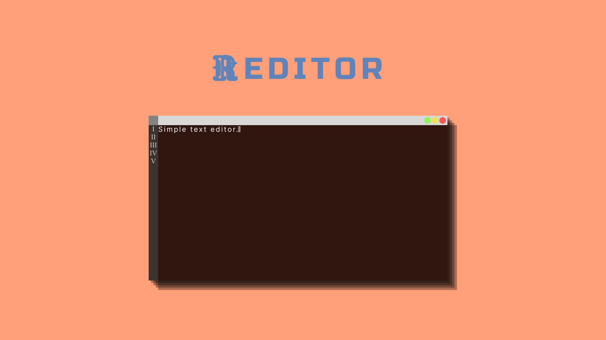

Text editor written in Rust

## Table of Content
- [About](#about)
- [Dependencies](#dependencies)
- [New features ideas](#new-features-ideas)

## About
A fun little side project to learn more about rust. Please, enjoy! :smile:

## Dependencies
The only one is `crossterm`, which makes the whole package cross-platform - To any Windows users out there! I'm talking to you! :wink: 

## New features ideas
- [ ] Drawing text on the screen
- [ ] Undo/Redo
- [ ] Show line numbers
- [ ] Line wrapping
- [ ] Saving/Opening files
- [ ] Save to window dialog
